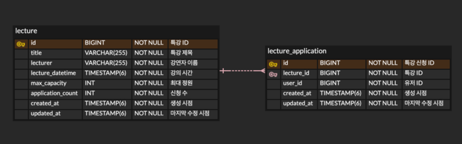
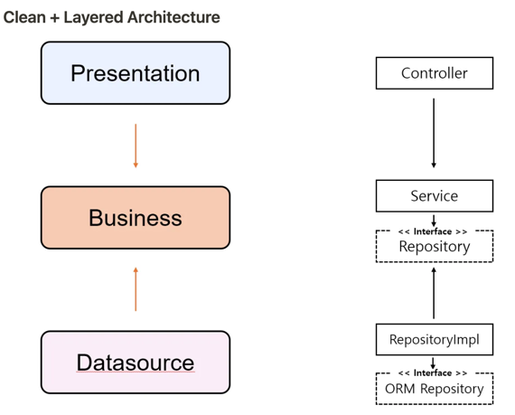
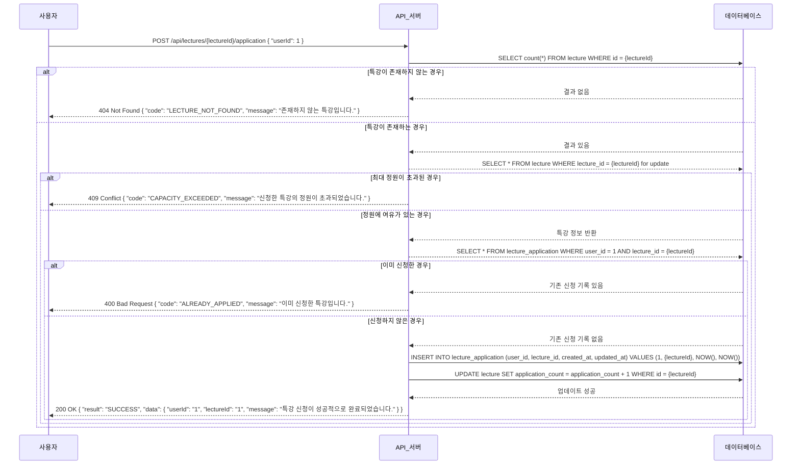

# 항해플러스 2주차 - 클린 아키텍처를 적용한 특강 신청 어플리케이션 개발

## 목표
-  [과제 요구사항 명세](과제_요구사항_명세.md)에 있는 기본 / Step03 / Step04 요구사항에 대해서 모두 만족하는 것이 목표입니다.

## ERD

### `lecture`
- 각 특강에 대한 정보 저장하기 위해 설계되었습니다. 다음과 같은 컬럼을 포함합니다

id: 각 특강을 고유하게 식별하는 기본 키.

title: 특강 이름으로, 화면에 표시 및 식별을 위해 필요합니다.

lecturer: 특강을 진행하는 강연자의 이름.

lecture_datetime: 특강이 진행될 시간을 나타내는 타임스탬프.

max_capacity: 해당 특강에 허용되는 최대 참가자 수. 기본값은 0으로 설정되어 올바른 초기화를 보장합니다.

application_count: 현재까지 신청된 참가자 수를 추적하여 정원 제한을 강제합니다.

created_at: 특강 레코드가 생성된 시점을 기록하는 타임스탬프.

updated_at: 특강 레코드가 마지막으로 수정된 시점을 기록하는 타임스탬프.

### `lecture_application`

lecture_application 테이블은 각 특강에 대한 개별 신청 정보를 저장합니다.

id: 각 특강 신청을 고유하게 식별하는 기본 키.

lecture_id: lecture 테이블과 연결되는 외래 키로, 신청이 유효한 특강과 연관되도록 보장합니다.

user_id: 특강을 신청한 사용자의 식별자. 사용자별 신청 정보를 추적할 수 있습니다.

created_at: 신청 레코드가 생성된 시점을 기록하는 타임스탬프.

updated_at: 신청 레코드가 마지막으로 수정된 시점을 기록하는 타임스탬프.

### 사용 예시

1. 특강 신청

- `lecture` 테이블의 application_count가 max_capacity보다 낮으면 application_count 값을 1 증가시킵니다.
- lecture_id와 user_id를 연결하는 새로운 레코드를 `lecture_application` 테이블에 삽입합니다.

2. 신청 가능한 특강 조회

- `lecture` 테이블에서 application_count < max_capacity인 행을 선택합니다.
- lecture_datetime으로 추가 필터링을 수행하여 특강 날짜별 조회를 수행할 수 있습니다.

3. 신청 완료된 특강 조회

- lecture_application을 lecture와 lecture_id로 조인합니다.
- user_id로 필터링합니다.

## 아키텍처

- Clean + Layered Architecture 아키텍처로 구현.
- 여기서 저는 Business 계층에서 `LectureService`와 `ApplicationService`로 도메인 간 영역을 분리하였는데, 로직 작성 시 같이 참조하여 Presentation Layer에게 결과값을 전달해야 했기 때문에 추가적으로 Controller<-->Service 사이에 `Facade` 계층을 추가하여 과제를 진행했습니다. 

## API

### 특강 신청
- [API 명세](docs/api/특강_신청_API_명세.md)

### 신청 가능 특강 목록 조회
- [API 명세](docs/api/신청_가능_특강_목록_조회.md)

### 특강 신청 완료 목록 조회
- [API 명세](docs/api/특강_신청_완료_목록_조회.md)